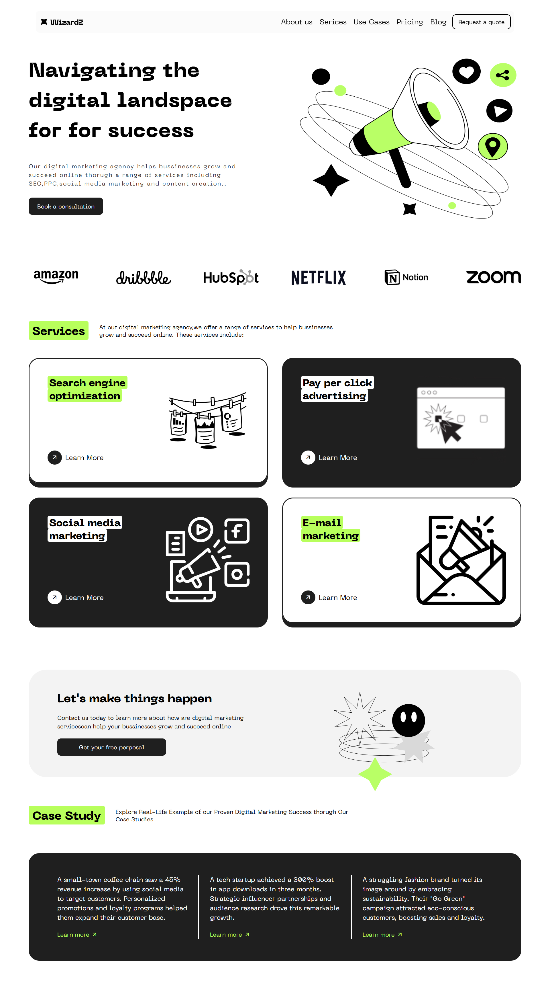

# WizardZ

**WizardZ** is a modern digital marketing agency website built as a frontend learning project. It features animated UI elements, a showcase of marketing services, and case studies, all powered by [GSAP (GreenSock Animation Platform)](https://greensock.com/gsap/). The project is inspired by concepts and tutorials from the Sheriyan YouTube channel, but all code and design are original and created from scratch as part of a hands-on learning process.

> **Note:** This project is currently **not responsive**. Responsive design will be added in the future as part of the learning journey.

## ✨ Features

- **Modern Design:** Clean layout with a focus on usability and visual appeal.
- **Animated UI:** Smooth entrance and scroll-based animations powered by GSAP and ScrollTrigger.
- **Service Showcase:** Highlights core digital marketing services (SEO, PPC, Social Media, Email Marketing).
- **Case Studies:** Realistic business case studies to demonstrate impact.
- **Contact & CTA Sections:** Prominent calls to action for user engagement.
- **Custom Fonts & Styles:** Uses "Neue Machina" for a unique, professional look.

## 🚀 Demo

### preview



[Link to the site](https://abhi-zero.github.io/WizardZ/)


## 🛠️ Tech Stack

- **HTML5** — Semantic, accessible markup
- **CSS3** — Custom styles, modern CSS reset
- **JavaScript (ES6+)** — Interactive features and animations
- **GSAP & ScrollTrigger** — Animation library for smooth, performant UI transitions
- **Remixicon** — Icon font for modern icons

## 📁 Project Structure

```
.
├── index.html          # Main HTML file
├── css/
│   └── style.css       # Custom styles and font imports
├── scripts/
│   └── script.js       # GSAP animations and interactivity
├── assets/
│   ├── images/         # Brand logos, illustrations, etc.
│   └── font/           # Custom font files (Neue Machina)
└── ...
```

## 🖥️ Getting Started

1. **Clone the repository:**
   ```bash
   git clone https://github.com/abhi-zero/WizardZ#
   cd WizardZ
   ```

2. **Open `index.html` in your browser.**
   - No build steps or dependencies required—everything runs in the browser.

3. **(Optional) Serve with Live Server:**
   - For the best experience, use a local server (like VSCode Live Server) to avoid CORS issues with local fonts and images.

## 📚 Learning Notes

- **Animations:** All animations are hand-coded using GSAP timelines and ScrollTrigger for scroll-based effects.
- **Inspiration:** The project is inspired by the Sheriyan YouTube channel, but all code and design are original and not copy-pasted.
- **Purpose:** This project is a personal learning exercise to master frontend development, animation, and modern web design.
- **Responsiveness:** The site is currently not responsive. Responsive design will be added as a future improvement.
- **Brand Logos:** The brand logos section is included as part of the design inspiration. The original designer is currently unknown; a link will be added once identified.

## 🙏 Credits

- **GSAP** for animation
- **Remixicon** for icons
- **Sheriyan YouTube Channel** for inspiration and learning resources
- **Original Designer:** _To be added once identified_

## 📄 License

This project is for educational purposes. If you wish to use or adapt it, please credit the original author and the Sheriyan channel for inspiration. 
